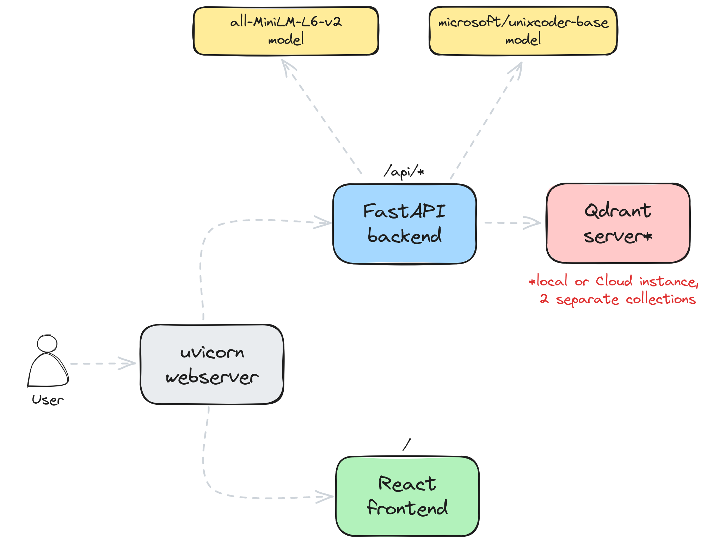

# Pycon 2024 튜토리얼: Rust 기반 코드 검색 툴 구현하기

개발자는 필요한 코드 조각을 찾을 수 있도록 돕는 코드 검색 툴이 필요합니다. 이 README에서는 이 툴을 설정하여 맥락에 맞는 코드 검색 결과를 제공하는 방법을 설명합니다.

## 사전 준비 사항

이 데모를 로컬 시스템에서 실행하려면 다음과 같은 구성 요소를 설치하고 설정해야 합니다:

- [Docker](https://www.docker.com/)
- [Docker Compose](https://docs.docker.com/compose/)
- [Rust](https://www.rust-lang.org/learn/get-started)
- [rust-analyzer](https://rust-analyzer.github.io/)

Docker 및 Docker Compose는 운영 체제에 따라 설정 방법이 다릅니다. 설치 방법은 공식 문서를 참고하세요. Rust와 rust-analyzer는 다음 명령어를 통해 설치할 수 있습니다:

```shell
curl --proto '=https' --tlsv1.2 -sSf https://sh.rustup.rs | sh
rustup component add rust-analyzer
```

## 설명

[Qdrant](https://qdrant.tech)을 활용하여 개발자가 필요한 코드를 맥락에 맞게 찾을 수 있도록 설정할 수 있습니다.
시맨틱 검색을 통해, 정확한 키워드나 함수, 클래스, 변수 이름을 정확히 모를 때에도 코드 예제를 검색할 수 있습니다.

이 데모에서는 [Rust로 만든 자동차 경주 게임](https://github.com/sigridjineth/rust-racingcar)를 사용하여 코드 스니펫을 검색할 수 있는 애플리케이션을 구현했습니다.
이 애플리케이션은 데이터 분할, 색인 생성, 검색 과정 전반을 아우릅니다. 이와 같이 코드를 검색할 때는 프로그래밍 언어의 구문뿐만 아니라 함수, 클래스, 변수 이름과 설명(왜 그리고 무엇을 하는지)이 중요한 역할을 합니다. 이러한 요구 사항을 충족하기 위해 다음 신경망 인코더를 사용합니다:

- `all-MiniLM-L6-v2` - 자연어 처리 분야에서 널리 사용되는 모델 중 하나
- `microsoft/unixcoder-base` - 코드 데이터셋에 특화된 모델

### 분할 및 색인 생성 프로세스

시맨틱 검색은 구조화된 소스 코드 저장소에서 가장 효과적입니다. 코드베이스를 여러 청크로 나눌 때, 각 청크는 특정 함수, 구조체, 열거형 등 하나의 독립된 코드 구조에 해당하도록 합니다.

각 모델은 코드의 중요한 부분을 추출하여 신경망이 이해할 수 있는 형식으로 변환합니다. 이후 Qdrant 컬렉션에 JSON 구조와 함께 색인화됩니다.

사용하는 모델은 다음과 같습니다.

#### all-MiniLM-L6-v2

코드를 청크로 나누지만, 일반적인 자연어 처리와는 달리 함수나 클래스뿐만 아니라 정의된 위치도 포함됩니다. 예를 들어 Qdrant 모듈의 `upsert` 함수는 다음과 같이 구조화됩니다:

```json
{
    "name": "upsert",
    "signature": "fn upsert (& mut self , id : PointOffsetType , vector : SparseVector)",
    "code_type": "Function",
    "docstring": "= \" Upsert a vector into the inverted index.\"",
    "line": 105,
    "line_from": 104,
    "line_to": 125,
    "context": {
        "module": "inverted_index",
        "file_path": "lib/sparse/src/index/inverted_index/inverted_index_ram.rs",
        "file_name": "inverted_index_ram.rs",
        "struct_name": "InvertedIndexRam",
        "snippet": "    /// Upsert a vector into the inverted index.\n    pub fn upsert(&mut self, id: PointOffsetType, vector: SparseVector) {\n        for (dim_id, weight) in vector.indices.into_iter().zip(vector.values.into_iter()) {..."
    }
}
```

이 프로젝트는 Rust로 작성된 Qdrant 소스 코드를 대상으로 검색 기능을 구현하는 것을 목표로 합니다. 이를 위해 별도의 [rust-parser 프로젝트](https://github.com/qdrant/rust-parser)를 작성하여 JSON 객체로 변환합니다.

#### microsoft/unixcoder-base

이 모델은 코드 조각을 중점적으로 다룹니다. 정의와 설명을 추출하여 모델에 전달합니다. Rust에서는 [rust-analyzer](https://rust-analyzer.github.io/)를 통해 코드베이스를 LSIF 형식으로 변환하고, 해당 위치를 바탕으로 직접 정의를 추출합니다. 모델에 코드 조각을 직접 전달하여 임베딩을 생성합니다.

```rust
/// Upsert a vector into the inverted index.
pub fn upsert(&mut self, id: PointOffsetType, vector: SparseVector) {
    for (dim_id, weight) in vector.indices.into_iter().zip(vector.values.into_iter()) {...}
}
```

두 인코더를 함께 사용하여 자연어와 코드 기반 검색 쿼리를 처리할 수 있습니다.

### 검색 프로세스

사용자 입력은 두 인코더에 전달되고, 생성된 벡터로 Qdrant 컬렉션을 동시에 쿼리하여 중복을 제거한 결과를 사용자에게 반환합니다.

## 아키텍처

이 데모는 백엔드로 [FastAPI](https://fastapi.tiangolo.com/) 프레임워크, 프론트엔드로 [React](https://reactjs.org/)를 사용합니다.



구성 요소는 다음과 같습니다:
- [React 프론트엔드](/frontend) - Qdrant 코드베이스에서 검색할 수 있는 웹 애플리케이션
- [FastAPI 백엔드](/code_search/service.py) - Qdrant와 통신하여 REST API를 노출
- [Qdrant](https://qdrant.tech/) - 데이터를 저장하고 검색을 수행하는 벡터 검색 엔진
- 두 개의 신경망 인코더 - 하나는 자연어, 다른 하나는 코드 작업 전용

주기적으로 실행해야 하는 색인 업데이트 구성 요소도 포함되어 있으며, [`tools`](/tools) 디렉토리에서 관련 스크립트를 확인할 수 있습니다.

## 사용법

시맨틱 검색 시스템은 몇 가지 설정 단계가 필요합니다. 먼저 데이터를 삽입하여 쿼리를 위한 인덱스를 생성해야 합니다.

### 데이터 색인화

로컬 환경에서는 다음 명령으로 Qdrant를 실행할 수 있습니다:

```shell
docker run -p 6333:6333 -p 6334:6334 \
    -v $(pwd)/qdrant_storage:/qdrant/storage:z \
    qdrant/qdrant
```

설정을 완료하면 Qdrant 인스턴스를 구성하고 다음 명령으로 색인을 구축합니다:

```shell
export QDRANT_URL="http://localhost:6333"

bash tools/download_and_index.sh
```

### 프론트엔드

프론트엔드 빌드를 하셔야 합니다. 여기서는 pnpm을 사용하겠습니다.

```shell
cd frontend
pnpm i
pnpm build
```

### 검색 서비스

색인이 완료되면 다음 명령어로 검색 서비스를 시작합니다:

```shell
docker-compose up
```

UI는 [http://localhost:8000/](http://localhost:8000/)에서 확인할 수 있으며, 검색어를 입력하면 관련 코드 구조를 볼 수 있습니다.

## 추가 작업

아래 TODO를 조금 더 해보실 수도 있겠습니다.

1. 하나의 신경망 인코더를 비활성화하고 검색 결과를 비교해보세요.
2. 다른 인코더 모델을 사용해보고 검색 품질에 미치는 영향을 확인하세요.
3. 이 프로젝트를 포크하여 Rust 외의 프로그래밍 언어를 지원하도록 해보세요.
4. 정답 데이터셋을 구축하여 검색 품질을 평가해보세요.
5. Answer API를 프론트엔드에 추가한다.